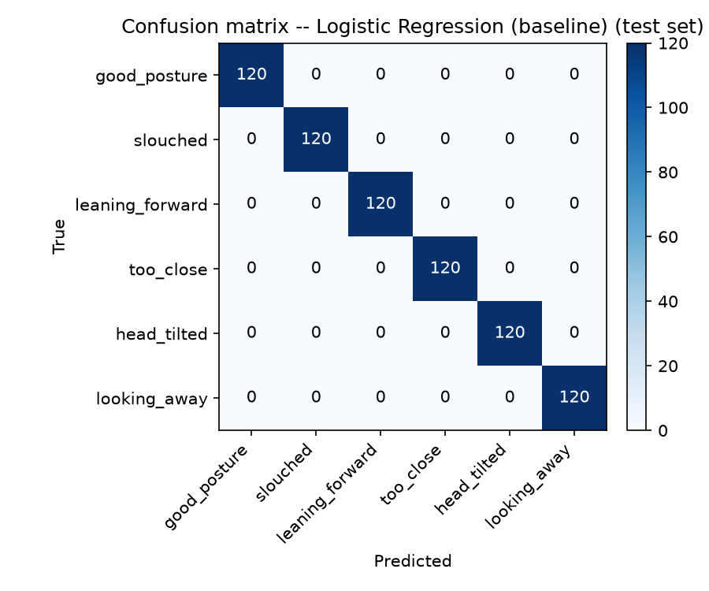

# SlouchFix -- Evaluation Report

Dataset: **3600 labeled frames** from **5 people** in `data/raw/`.

> **Synthetic dataset notice:** every person_id in this run comes from `scripts/_make_synthetic_dataset.py`, not a real recorded person. These numbers validate that the training/evaluation/ablation pipeline runs correctly end-to-end and are **not evidence the trained model works on real posture data** -- the synthetic label profiles are cleanly separated by construction, so high scores here are expected and not a claim of real-world accuracy. Re-run this script after collecting real sessions with `python -m slouchfix.data_collection --person <id>` (need at least 3 distinct real people for the person-disjoint split) to get numbers that mean anything about real-world performance.

## Baselines vs trained models (test set, person-disjoint)

| Model | Accuracy | Macro F1 | Distance MAE (cm) | Latency |
|---|---|---|---|---|
| Baseline 1: rule-based (calibrated) | 0.914 | 0.908 | 4.6 | 0.00 ms (230521 FPS) |
| Baseline 2: naive pose (uncalibrated) | 0.910 | 0.904 | 4.7 | 0.00 ms (289855 FPS) |
| Logistic Regression (baseline) | 1.000 | 1.000 | 2.6 | 0.37 ms (2688 FPS) |
| Random Forest | 0.997 | 0.997 | 2.5 | 133.08 ms (8 FPS) |
| XGBoost | 0.999 | 0.999 | 2.7 | 2.35 ms (425 FPS) |
| MLP (PyTorch) | 0.999 | 0.999 | 2.7 | 0.47 ms (2111 FPS) |

**Result:** the best trained model (**Logistic Regression (baseline)**, macro F1=1.000) beats the calibrated rule-based baseline (macro F1=0.908).

## Confusion matrix -- Logistic Regression (baseline) (best trained model)

## Ablation A: calibration-relative vs raw-absolute features (MLP)

Tests whether normalizing features against a per-person baseline -- the same architectural idea behind the rule-based baseline's calibration step -- also helps the *trained* model. See `slouchfix/models/ablations.py` for exactly how the per-person baseline is computed.

| Arm | Accuracy | Macro F1 | Distance MAE (cm) |
|---|---|---|---|
| with_calibration | 0.999 | 0.999 | 2.7 |
| without_calibration | 0.999 | 0.999 | 2.7 |

## Ablation B: full feature set vs motion-feature-ablated (MLP)

The build brief's suggested second ablation (landmark-only vs raw-frame CNN features) needs a separate image-input training pipeline that's out of scope for this lightweight Phase 1 pass. Substituted: full 10-feature set vs the same set with `motion_score` (the only feature requiring frame-history, i.e. the only 'temporal' feature) removed, to see whether that signal earns its complexity.

| Arm | Accuracy | Macro F1 | Distance MAE (cm) |
|---|---|---|---|
| full_features | 0.999 | 0.999 | 2.7 |
| no_motion_feature | 1.000 | 1.000 | 2.8 |

## Qualitative analysis

Not included in this run: qualitative screenshots require an actual live webcam session, which this automated evaluation script does not perform (there's no real person or camera in a synthetic-dataset run). Once real sessions exist, run `python scripts/run_app.py --preview` and press `s` during good_posture and each flagged case (slouched, leaning_forward, too_close, head_tilted, looking_away) to save labeled screenshots to `reports/qualitative/`, then reference them here.

## Known limitations (Phase 1 scope)

- Distance regression MAE and posture accuracy above are only as good as the bootstrap dataset; see the dataset notice at the top of this report.
- The orientation/mounting-angle corner case (lid angle, lap vs. table, riser height) is handled by calibrating relative to a personal baseline (`slouchfix/calibration.py`) rather than fixed absolute thresholds, plus a frame-to-frame drift monitor (`slouchfix.calibration.RecalibrationMonitor`) that flags when the current session's calibration may be stale. Accelerometer-based absolute gravity fusion is deferred to a Phase 2 mobile build; `slouchfix.baseline.classify` already accepts an optional `device_tilt_angle` parameter (default `None`) as that future seam.
- No CNN/raw-frame model was trained this phase (see Ablation B); model export is PyTorch -> ONNX only, no TFLite/mobile export yet.
